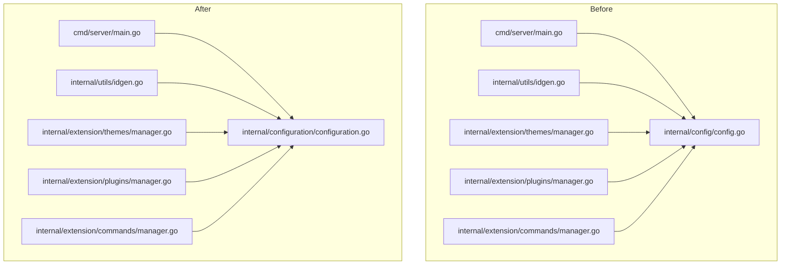

# Project Refactor and Update Plan

This document outlines the plan for several updates and refactoring tasks for the PanelBase project.

## Overall Task Order

The tasks will be addressed in the following general order:

1.  **Task 4 (Refactor): Isolate Configuration Management Logic**
    *   Move configuration handling into a new `internal/configuration` package.
2.  **Task 1 (Feature Update): Update THEMES Installation Configuration Format**
    *   Modify `theme.yaml` (created by `themes create`) and `theme.json` (used by `themes install/update` locally) to support a new `authors` structure and a new `structure` format where file entries include a `sum` (SHA256 checksum).
3.  **Task 2 (Refactor/Review): Consolidate THEMES-related functions within the THEMES package.**
    *   Review and ensure CLI commands for themes are thin wrappers around the `themes` package API.
4.  **Task 3 (Code Cleanup): Remove comments from import sections in all `.go` files.**

---

## Detailed Implementation Plan

### Part 1: Task 4 - Isolate Configuration Management Logic (`internal/configuration`)

**Goal**: Decouple configuration loading and management from other parts of the application by moving it from `internal/config/config.go` to a new package `internal/configuration`.

**Steps**:

1.  **Create New Package Directory**:
    *   Create directory: `internal/configuration`

2.  **Move and Rename File**:
    *   Move [`internal/config/config.go`](internal/config/config.go:0) to `internal/configuration/configuration.go`.
    *   Update `internal/configuration/configuration.go`'s package declaration to `package configuration`.

3.  **Verify Constant Paths**:
    *   In `internal/configuration/configuration.go`, ensure constants like `defaultConfigDir`, `defaultConfigPath`, `defaultThemesStatePath`, etc., remain valid relative to the project root. (Current relative paths should be fine).

4.  **Update Import Paths and Package References**:
    *   In the following files, change `import "github.com/OG-Open-Source/PanelBase/internal/config"` to `import "github.com/OG-Open-Source/PanelBase/internal/configuration"`:
        *   [`internal/utils/idgen.go`](internal/utils/idgen.go:10)
        *   [`internal/extension/themes/manager.go`](internal/extension/themes/manager.go:20)
        *   [`internal/extension/plugins/manager.go`](internal/extension/plugins/manager.go:14)
        *   [`internal/extension/commands/manager.go`](internal/extension/commands/manager.go:16)
        *   [`cmd/server/main.go`](cmd/server/main.go:20)
        *   (Consider [`internal/rpc/server.go`](internal/rpc/server.go:10) if its commented-out import is re-enabled).
    *   Update all calls to functions from this package (e.g., `config.LoadConfig()` becomes `configuration.LoadConfig()`).

5.  **Testing**:
    *   Run `go mod tidy`.
    *   Run `go build -o server.exe ./cmd/server`.
    *   Perform runtime tests for features relying on configuration loading (e.g., server startup, listing themes).

**Mermaid Diagram - Package Dependency Change (Task 4)**:


---

### Part 2: Task 1 - Update THEMES Installation Configuration Format

**Goal**: Modify `theme.yaml` (generated by `create`) and `theme.json` (used locally by `install`/`update`) to support a new `authors` structure and a `structure` where file entries include a `sum` (SHA256 checksum).

**Clarifications Received**:
*   `sum` (SHA256) will be calculated for local files during `themes create` and written to `theme.yaml`.
*   `themes install` will verify this `sum` after downloading; if mismatched, installation terminates.
*   For `authors` input during `themes create`, only names (comma-separated) will be collected. `email` and `url` for authors will be omitted in the generated `theme.yaml`.
*   `theme.yaml` is generated by `create`; `theme.json` is used internally for installed themes in `ext/themes/<theme_id>/`. This distinction will be maintained.

**Steps**:

1.  **Update Go Struct Definitions ([`internal/extension/themes/types.go`](internal/extension/themes/types.go:0))**:
    *   Define `AuthorDetail` struct:
        ```go
        type AuthorDetail struct {
            Name  string `yaml:"name" json:"name"`
            Email string `yaml:"email,omitempty" json:"email,omitempty"`
            URL   string `yaml:"url,omitempty" json:"url,omitempty"`
        }
        ```
    *   Define `AssetDetail` struct:
        ```go
        type AssetDetail struct {
            URL string `yaml:"url" json:"url"`
            Sum string `yaml:"sum" json:"sum"` // SHA256 hash
        }
        ```
    *   Modify `ThemeMetadata` struct:
        *   Change `Authors []string` to `Authors []AuthorDetail`.
        *   The `Structure map[string]interface{}` declaration remains, but its file-entry values will now be `AssetDetail` instances.

2.  **Update Validation Logic ([`internal/extension/themes/types.go`](internal/extension/themes/types.go:0))**:
    *   Modify `ThemeMetadata.Validate()`:
        *   Update `Authors` validation to iterate `[]AuthorDetail` and check `author.Name`.
    *   Modify `validateStructureContent()`:
        *   Adapt to expect `AssetDetail` objects for file entries.
        *   Validate `AssetDetail.URL` as an absolute URL.
        *   Validate `AssetDetail.Sum` as a 64-character hex string (SHA256 format).
        *   Remove handling for direct string (URL) values for file entries.

3.  **Update `_scanDirectoryStructure()` ([`internal/extension/themes/manager.go`](internal/extension/themes/manager.go:0))**:
    *   Import `crypto/sha256`, `encoding/hex`, `io`, `os`.
    *   When processing a file:
        *   Calculate its SHA256 sum: open file, `io.Copy` to `sha256.New()`, then `hex.EncodeToString(hasher.Sum(nil))`.
        *   Construct `AssetDetail{URL: fileURL.String(), Sum: hexSum}`.
        *   Set `structure[entryName] = assetDetail`.

4.  **Update `Create()` Function ([`internal/extension/themes/manager.go`](internal/extension/themes/manager.go:0))**:
    *   When constructing `newMeta ThemeMetadata`:
        *   Convert the input `authors []string` to `[]AuthorDetail`, populating only the `Name` field in each `AuthorDetail`.

5.  **Update `downloadAndSaveStructure()` ([`internal/extension/themes/manager.go`](internal/extension/themes/manager.go:0))**:
    *   Modify to handle `AssetDetail` for file entries (from the `structure` map).
    *   After downloading a file and writing it locally (`io.Copy`):
        *   Close the local file.
        *   Re-open the local file, calculate its SHA256 sum.
        *   Compare with `AssetDetail.Sum`.
        *   If mismatched: delete the local file, return an error (e.g., `ErrChecksumMismatch`).
    *   Import `crypto/sha256`, `encoding/hex`, `io`, `os`.

6.  **Update `_downloadThemeAssets()` ([`internal/extension/themes/manager.go`](internal/extension/themes/manager.go:0))**:
    *   Ensure it correctly passes `AssetDetail` information (implicitly via `meta.Structure`) to `downloadAndSaveStructure`. (Current direct passing of `meta.Structure` should be fine as `downloadAndSaveStructure` will iterate it).

7.  **Update `countFilesInStructure()` ([`internal/extension/themes/manager.go`](internal/extension/themes/manager.go:0))**:
    *   Modify to correctly count files when `item` in structure is an `AssetDetail` object.

8.  **Update `_writeLocalThemeJSON()` and `_loadLocalThemeJSON()` ([`internal/extension/themes/manager.go`](internal/extension/themes/manager.go:0))**:
    *   These functions handle `theme.json` using `encoding/json`. Ensure they correctly (de)serialize the updated `ThemeMetadata` (with `[]AuthorDetail` and `Structure` containing `AssetDetail`). The existing `json` tags on the new structs should suffice.
    *   Clarify/confirm that `themeMetaFile` constant in these functions' context refers to `"theme.json"`. Consider using a separate constant or hardcoding `"theme.json"` for clarity.

9.  **Update CLI Output ([`cmd/server/main.go`](cmd/server/main.go:0))**:
    *   `themeCreateCmd`: Adjust printing of `Authors` from `createdMeta.Authors` (now `[]AuthorDetail`) to extract and join names.
    *   `themeListCmd` (for specific theme): Adjust printing of `Authors` similarly.

10. **Testing**:
    *   `go mod tidy`, `go build`.
    *   `themes create`: Verify `theme.yaml` format (authors, structure with URL and sum). Verify sums are correct.
    *   `themes install`:
        *   Install with a valid `theme.yaml` (correct sums). Verify success and `ext/themes/<id>/theme.json` format.
        *   Install with a `theme.yaml` where a `sum` is intentionally incorrect. Verify installation fails with a checksum error.
    *   `themes list`, `themes list <id>`: Verify correct display of new formats.
    *   `themes update`: Verify it handles new format and checksums during update.
    *   `themes remove`.

**Mermaid Diagram - ThemeMetadata Structure Change (Task 1)**:
```mermaid
classDiagram
    ThemeMetadata "1" --|> "0..*" AuthorDetail : authors (YAML: authors, JSON: authors)
    ThemeMetadata "1" --|> "map" StructureEntry : structure (YAML: structure, JSON: structure)

    class AuthorDetail {
      +Name: string (YAML: name, JSON: name)
      +Email: string (YAML: email,omitempty, JSON: email,omitempty)
      +URL: string (YAML: url,omitempty, JSON: url,omitempty)
    }

    StructureEntry "1" --|> "1" AssetDetail_Or_NestedMap : value
    class AssetDetail_Or_NestedMap {
        <<interface>>
    }
    AssetDetail_Or_NestedMap <|-- AssetDetail
    AssetDetail_Or_NestedMap <|-- "map[string]AssetDetail_Or_NestedMap" : for nested directories

    class AssetDetail {
      +URL: string (YAML: url, JSON: url)
      +Sum: string (YAML: sum, JSON: sum)  // SHA256
    }
    note for ThemeMetadata "Structure's value can be an AssetDetail or another map for nesting"
```

---

### Part 3: Task 2 - Consolidate THEMES-related functions

**Goal**: Review CLI commands and `themes` package interactions, ensuring business logic resides primarily in the `themes` package.

**Steps**:

1.  **Review `theme*Cmd` in [`cmd/server/main.go`](cmd/server/main.go:0)**:
    *   `themeCreateCmd`, `themeInstallCmd`, `themeUpdateCmd`, `themeRemoveCmd`: Already identified as reasonably thin. No major changes expected beyond those for Task 1.
    *   `themeListCmd`:
        *   When listing a specific theme, it currently reads `configs/themes.json` and `ext/themes/<id>/theme.json` directly.
        *   **Refactor**: Create a new public function in the `themes` package, e.g., `GetThemeDetails(tm *ThemeManager, themeID string) (*ThemeMetadata, *configuration.InstalledThemeEntry, error)`.
            *   This function will encapsulate the logic of loading the local `theme.json` (using `_loadLocalThemeJSON`) and the global state entry from `configuration.LoadThemesState()`.
            *   It should return the parsed `ThemeMetadata` from `theme.json` and the `InstalledThemeEntry` from global state.
        *   Modify `themeListCmd` to call `themes.GetThemeDetails()` and then format the output in the CLI.

2.  **Implement Refactoring**:
    *   Add `GetThemeDetails` function to [`internal/extension/themes/manager.go`](internal/extension/themes/manager.go:0).
    *   Update `themeListCmd` in [`cmd/server/main.go`](cmd/server/main.go:0) to use it.

3.  **Testing**:
    *   Test `theme list <id>` thoroughly to ensure it displays correct and complete information.
    *   Verify other `theme*Cmd` commands still function as expected.

---

### Part 4: Task 3 - Remove Comments from Import Sections

**Goal**: Clean up all `.go` files by removing line-end comments from `import` blocks.

**Steps**:

1.  **Identify Target Files**:
    *   The list of `.go` files was previously generated:
        *   [`cmd/server/main.go`](cmd/server/main.go:0)
        *   `internal/configuration/configuration.go` (formerly [`internal/config/config.go`](internal/config/config.go:0))
        *   [`internal/container/manager.go`](internal/container/manager.go:0)
        *   [`internal/container/types.go`](internal/container/types.go:0)
        *   [`internal/container/webserver.go`](internal/container/webserver.go:0)
        *   [`internal/extension/commands/manager.go`](internal/extension/commands/manager.go:0)
        *   [`internal/extension/commands/types.go`](internal/extension/commands/types.go:0)
        *   [`internal/extension/plugins/manager.go`](internal/extension/plugins/manager.go:0)
        *   [`internal/extension/plugins/types.go`](internal/extension/plugins/types.go:0)
        *   [`internal/extension/themes/manager.go`](internal/extension/themes/manager.go:0)
        *   [`internal/extension/themes/types.go`](internal/extension/themes/types.go:0)
        *   [`internal/logger/logger.go`](internal/logger/logger.go:0)
        *   [`internal/rpc/server.go`](internal/rpc/server.go:0)
        *   [`internal/utils/idgen.go`](internal/utils/idgen.go:0)

2.  **Edit Each File**:
    *   For each file, locate the `import (...)` block.
    *   Remove any trailing comments on lines that specify an import path.
    *   Example: `import "fmt" // For printing` becomes `import "fmt"`.

3.  **Format Code (Recommended)**:
    *   After editing, run `go fmt ./...` from the project root to ensure consistent formatting.

4.  **Testing**:
    *   Run `go build -o server.exe ./cmd/server` to confirm no syntax errors were introduced.

---

This completes the detailed plan.