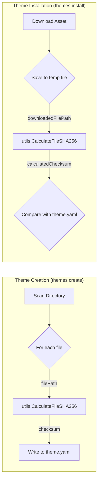

# SHA256 Utility Implementation and Integration Plan

## 1. Background: SHA256 and Line Endings

It's crucial to understand that the standard SHA256 algorithm operates on the exact binary content of a file. Files with CRLF (`\r\n`) line endings will have different binary content and thus different SHA256 checksums compared to files with LF (`\n`) line endings, even if their visual text content is identical. Any tool that reports identical checksums for such files is likely normalizing line endings before calculation.

This plan aims to create a consistent, binary-sensitive SHA256 calculation utility and integrate it, but the underlying issue of EOL mismatches between `theme.yaml` sums and remote file sums must be addressed by EOL normalization in the Git repository (e.g., via `.gitattributes`).

## 2. Part 1: Create SHA256 Utility Function

### 2.1. New File
Create a new file: `internal/utils/checksum.go`

### 2.2. Core Function Design
Define a public function within `internal/utils/checksum.go`:

```go
package utils

import (
	"crypto/sha256"
	"encoding/hex"
	"io"
	"os"
)

// CalculateFileSHA256 calculates the SHA256 checksum of the file at the given path.
// It computes the hash based on the exact binary content of the file.
func CalculateFileSHA256(filePath string) (string, error) {
	file, err := os.Open(filePath)
	if err != nil {
		return "", err // Return error if file cannot be opened
	}
	defer file.Close()

	hasher := sha256.New()
	if _, err := io.Copy(hasher, file); err != nil {
		return "", err // Return error if copying file content to hasher fails
	}

	return hex.EncodeToString(hasher.Sum(nil)), nil
}
```

**Mermaid Diagram for `CalculateFileSHA256`:**
```mermaid
graph TD
    A[checksum.go] --> B(CalculateFileSHA256);
    B -- filePath --> C{os.Open};
    C -- fileHandle/error --> D{Error?};
    D -- Yes --> G[Return "", error];
    D -- No --> H{sha256.New};
    H -- hasher --> I{io.Copy(hasher, fileHandle)};
    I -- bytesCopied/error --> J{Error?};
    J -- Yes --> G;
    J -- No --> K{hasher.Sum(nil)};
    K -- hashBytes --> L{hex.EncodeToString};
    L -- hexString --> M[Return hexString, nil];
```

### 2.3. Unit Tests
Create `internal/utils/checksum_test.go` with unit tests for `CalculateFileSHA256`.
Test cases should include:
*   An empty file.
*   A small file with known content and pre-calculated SHA256 sum.
*   A non-existent file path (expecting an error).
*   **Crucial Test:** Two temporary files with visually identical text content but one using CRLF line endings and the other using LF line endings. Assert that `CalculateFileSHA256` returns **different** checksums for these two files.

## 3. Part 2: Integrate Utility into `themes` Package

### 3.1. Modify `themes create` Process
*   Locate the function responsible for scanning the theme directory and calculating checksums (e.g., `_scanDirectoryStructure` in `internal/extension/themes/manager.go`).
*   Replace the inline SHA256 calculation logic with a call to `utils.CalculateFileSHA256(filePath)`.

### 3.2. Modify `themes install` Process
*   Locate the function responsible for downloading theme assets and verifying checksums (e.g., `downloadAndSaveStructure` in `internal/extension/themes/manager.go`).
*   When a file is downloaded and its checksum needs to be calculated for verification against `theme.yaml`, replace the inline SHA256 calculation logic with a call to `utils.CalculateFileSHA256(downloadedFilePath)`.

**Mermaid Diagram for Integration:**


## 4. Part 3: Addressing the Root Cause - Line Ending Normalization

While the above steps will ensure consistent checksum calculation within the application, the `themes install` command will still fail if the checksums in `theme.yaml` (generated from local files, potentially CRLF) do not match the checksums of files downloaded from a remote source (like GitHub Raw, which typically serves LF files).

**Strong Recommendation:**
1.  **Implement `.gitattributes`:** Create or modify the `.gitattributes` file in the project root with the line `* text=auto eol=lf`. This instructs Git to normalize line endings to LF for all text files upon commit.
2.  **Renormalize Files:** After setting up `.gitattributes`, run `git add . --renormalize` in your local repository and commit any changes. This ensures your local files (and subsequently those pushed to GitHub) have LF line endings where appropriate.
3.  **Re-generate `theme.yaml`:** After EOL normalization, re-run `themes create` for your theme(s). The generated `theme.yaml` will now contain checksums based on LF line-ended files.
4.  **Push Changes:** Push the updated `.gitattributes`, re-normalized files, and the new `theme.yaml` to GitHub.

With these steps, the checksums generated by `themes create` (from LF files) should match the checksums calculated by `themes install` for files downloaded from GitHub Raw (which are also LF).